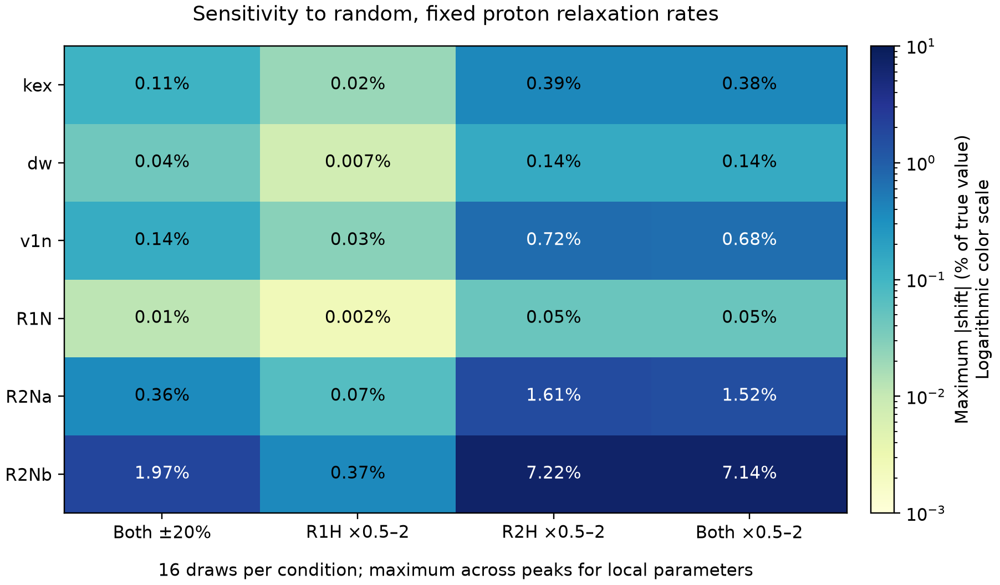

# 무작위 peak별 R1H·R2H 고정값의 영향 검사

검사일: 2026-10-02. 1.2 GHz·30 ppm의 3-peak 합성 데이터에 대한 검사다.

## 결과 요약

무작위 H 고정값 64회와 대조·재확인을 포함한 총 72회 fitting을 완료했다.
요청한 파라미터 모두에 수치적인 영향이 있었으며, 이번 범위에서는 R2H 가정의 영향이 더 컸다.
R1H만 0.5–2배로 바꾼 경우 기록한 파라미터의 변화는 기준 국소 표준오차의 최대 0.16배였다.
두 H rate를 ±20% 범위로 바꾼 경우에도 최대 0.95배였다.
그러나 R2H만 0.5–2배로 바꾸면 R2Nb는 최대 7.22%, v1n은 최대 0.72% 변했다.
둘 다 0.5–2배로 바꾼 경우 v1n 변화는 기준 표준오차의 최대 4.16배였으므로, 상대 변화가 1% 미만이라는 이유만으로 무시할 수 없다.
이 조건에서는 R1H 고정값의 영향이 작았다. R2H는 peak별 fitting 또는 고정값 민감도 검사를 유지하는 편이 타당하다.

## 검사 정의

`R1H`, `R2H`에 무작위 **고정값**을 넣고 `kab`, `kba`, `v1n_scale` 및
peak별 `peak_ppm`, `dw_ppm`, `R1`, `R2a`, `R2b`를 다시 fitting했다.
무작위 초기값을 넣은 뒤 H rates도 자유롭게 fitting한 검사가 아니다.
같은 peak의 A/B 상태와 여러 RF 파일은 같은 H rates를 사용하며, 서로 다른
peak의 H rates는 독립적으로 뽑았다. 각 fit의 자유 파라미터는 18개다.

측정 profile과 잡음 realization은 매번 동일하다. 따라서 올바른 H rates를
고정한 기준 fit과의 차이는 H rates 가정의 영향을 나타낸다. 생성값으로부터의
전체 오차와 기준 fit으로부터의 변화는 `statistics.json`에서 따로 기록했다.

| 조건 | R1H | R2H | 반복 수 |
|---|---|---|---:|
| Both ±20% | 참값 × U(0.8,1.2) | 참값 × U(0.8,1.2) | 16 |
| R1H ×0.5–2 | 참값 × log-U(0.5,2) | 참값 고정 | 16 |
| R2H ×0.5–2 | 참값 고정 | 참값 × log-U(0.5,2) | 16 |
| Both ×0.5–2 | 참값 × log-U(0.5,2) | 참값 × log-U(0.5,2) | 16 |

넓은 범위의 세 조건은 동일한 난수쌍을 사용한다. 난수 seed는 20261004다.
이는 지정한 민감도 시험 범위이며, 모든 단백질의 일반적인 실험 범위라는 뜻은 아니다.

H rate 생성값 (s⁻¹): A1=(2,25), G2=(1.2,18), S3=(3,35).
각 profile은 105–135 ppm의 147점, 간격 24.985 Hz, RF 25/50/100 Hz,
T=0.4 s, intensity σ=0.001이다. 전체 관측점은 1323개다.
RR decoupling은 90°x–240°y–90°x 반복이며 p90=70 μs다.

## 요청한 파라미터별 최대 변화

아래 값은 `100 × |무작위 H 고정 fit − 기준 fit| / |생성값|`이다.
각 조건에서 관찰한 최댓값이며, 잔기별 파라미터는 3개 peak 전체의 최댓값을 표시한다.
미지의 모든 H rates에 대한 보장 범위나 confidence interval이 아니다.

| 파라미터 | Both ±20% | R1H ×0.5–2 | R2H ×0.5–2 | Both ×0.5–2 |
|---|---:|---:|---:|---:|
| kex | 0.1109% | 0.0211% | 0.3887% | 0.3824% |
| dw | 0.0418% | 0.0072% | 0.1424% | 0.1427% |
| v1n | 0.1368% | 0.0268% | 0.7157% | 0.6800% |
| R1N | 0.0119% | 0.0025% | 0.0465% | 0.0458% |
| R2Na | 0.3618% | 0.0679% | 1.6084% | 1.5197% |
| R2Nb | 1.9739% | 0.3666% | 7.2248% | 7.1396% |

`v1n`은 공통 RF scale을 fitting했다. 실제 25/50/100 Hz RF 값의 상대 변화도
동일하다. `dw`는 부호를 유지한 ppm 파라미터이며 상대 변화의 분모는 |dw_true|다.



## 넓은 범위에서 둘 다 무작위로 고정한 결과

Median과 max는 기준 fit으로부터의 절댓값 변화다. 마지막 열은 동일한 변화를
기준 fit의 국소 표준오차로 나눈 값이며, H-rate 불확도를 포함한 총 오차가 아니다.

| 파라미터 | 생성값 | 기준 fit | Median 변화 (%) | 최대 변화 (%) | 최대 변화 / 기준 SE |
|---|---:|---:|---:|---:|---:|
| kex | 300 | 299.5529 | 0.2588 | 0.3824 | 1.86 |
| pB | 0.05 | 0.04993912 | 0.2569 | 1.1609 | 4.10 |
| v1n_scale | 1.08 | 1.080863 | 0.1403 | 0.6800 | 4.16 |
| A1.dw_ppm | 3 | 3.001533 | 0.0398 | 0.0750 | 2.41 |
| G2.dw_ppm | 2.2 | 2.2007 | 0.0222 | 0.0539 | 1.31 |
| S3.dw_ppm | -2.5 | -2.502168 | 0.0823 | 0.1427 | 3.23 |
| A1.R1 | 1.5 | 1.500138 | 0.0145 | 0.0237 | 1.19 |
| G2.R1 | 1.3 | 1.299974 | 0.0103 | 0.0257 | 1.24 |
| S3.R1 | 1.7 | 1.700116 | 0.0252 | 0.0458 | 2.40 |
| A1.R2a | 12 | 11.96658 | 0.1671 | 1.2682 | 3.10 |
| G2.R2a | 10 | 9.994428 | 0.3971 | 1.5197 | 3.54 |
| S3.R2a | 16 | 16.03686 | 0.5969 | 0.9311 | 2.26 |
| A1.R2b | 15 | 15.04318 | 4.5384 | 7.1396 | 2.69 |
| G2.R2b | 20 | 19.54944 | 1.0050 | 1.6470 | 0.93 |
| S3.R2b | 25 | 24.52518 | 1.2239 | 3.9275 | 2.17 |

## Fit quality

기준 fit: χ²=1236.042180, dof=1305, reduced χ²=0.947159.

| 조건 | Reduced χ² min | median | max | 경계 도달 fit 수 |
|---|---:|---:|---:|---:|
| Both ±20% | 0.9476 | 0.9685 | 1.0027 | 0 |
| R1H ×0.5–2 | 0.9448 | 0.9473 | 0.9523 | 0 |
| R2H ×0.5–2 | 1.0170 | 1.1739 | 1.5253 | 0 |
| Both ×0.5–2 | 1.0197 | 1.1704 | 1.5096 | 0 |

## 잡음 없는 데이터 및 다른 초기값으로 재검사

파라미터 변화가 큰 두 fit과 χ²가 가장 큰 fit을 선정했다(중복 제외).
같은 H 고정값으로 무잡음 데이터를 fitting하고, 잡음 데이터에서는 다른 시작점으로
재fitting했다. 각 결과는 `exact_check_*`와 `restart_check_*` JSON에 보존했다.

| 선택한 fit | 잡음 fit χ² | 다른 시작점 χ² | 무잡음 fit χ² |
|---|---:|---:|---:|
| broad_R2H_06 | 1990.57952 | 1990.57958 | 634.40292 |
| broad_R2H_09 | 1860.17273 | 1860.17275 | 522.18066 |
| broad_both_09 | 1873.34965 | 1873.34968 | 532.77098 |

## 범위와 재현

- H rates를 참값으로 고정한 무잡음 fit은 모든 질소/RF 파라미터를 복원했다.
- 무작위 입력 fitting의 수렴 실패와 경계 도달을 기록했다. 실패를 조용히 제외하지 않았다.
- 기준 covariance는 중앙 차분과 dense Jacobian으로 계산했으며 reduced χ²로 재조정하지 않았다.
- 한 시료 조건, 3개 합성 peak, 고정된 잡음 realization에 대한 민감도다. 실제 시료나 다른 H shift/자기장/T에 일반화할 수 없다.
- 각 peak의 A/B 상태에 같은 H relaxation을 가정했다. 독립적인 상태별 relaxation은 검사하지 않았다.
- 기존 production fitting CLI는 변경하지 않았다.

```bash
cd /Users/donghanlee/work/projects/sbonest
.venv/bin/python check_random_proton_rates.py --out results/random_H_repeat_01 --draws 16 --workers 3
```

새 출력 폴더를 사용한다. 결과 파일은 덮어쓰지 않는다.

[검사 코드](check_random_proton_rates.py) · [전체 수치 CSV](results/random_H_rates/results.csv) ·
[전체 fitting JSON](results/random_H_rates/results.json) · [통계 JSON](results/random_H_rates/statistics.json) ·
[조건·source hash](results/random_H_rates/metadata.json) · [그림 PDF](results/random_H_rates/parameter_sensitivity.pdf) ·
[보고서/그림 생성 코드](results/random_H_rates/summarize.py)
