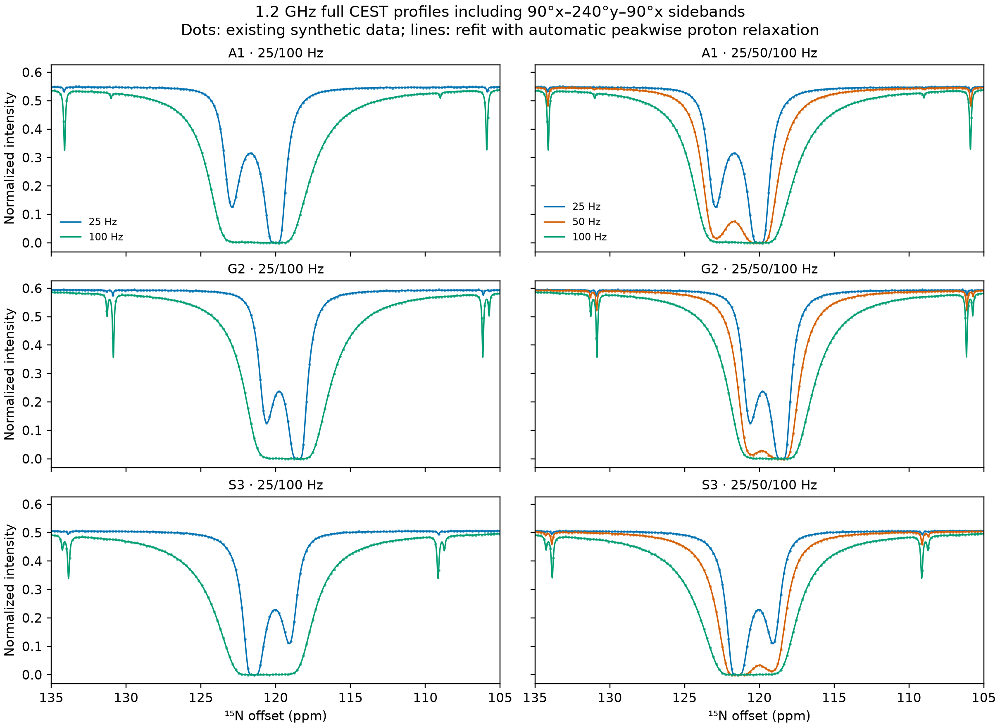

# SBONEST

Fit two-state ¹⁵N CEST profiles **including 90°x–240°y–90°x ¹H decoupling
sidebands**, using NH spin operators from OC. Fit nitrogen RF (`v1n`) as a
common scale or independently for each dataset, or keep it fixed.

**R1H and R2H need no user input.** If both are omitted, SBONEST estimates them
as independent nuisance parameters for each peak, alongside exchange, nitrogen
relaxation, and RF parameters. It starts at (2, 25) s⁻¹; these are starting
values, not arbitrary fixed rates. H rates are shared across RF datasets and
states A/B for the same peak. Current automatic mode supports one proton field.

[English manual](SBONEST_MANUAL.md) · [한국어 매뉴얼](SBONEST_MANUAL.ko.md) ·
[Model and configuration](SIDEBAND.md) · [Development handoff](HANDOFF.md)

## Install and run

Python 3.12 is the CI target. From a new checkout:

```bash
git clone https://github.com/Gohyang-Matzip/sbonest.git
cd sbonest
python3 -m venv .venv
.venv/bin/python -m pip install -r requirements-sideband.txt
export OMP_NUM_THREADS=1 OPENBLAS_NUM_THREADS=1 VECLIB_MAXIMUM_THREADS=1 MPLBACKEND=Agg
.venv/bin/python run.py example/sideband_auto_H/two_RF.json
```

OC is installed as `optimalcontrol-nmr`; a neighboring OC checkout is not
required. Add `--no-pdf` to skip figures while keeping numerical outputs.

The first example fits three peaks at **1.2 GHz, 25/100 Hz nitrogen RF,
105–135 ppm**, with 147 equally spaced offsets per peak and RF
(about 24.985 Hz between offsets). All 882 observations, including sidebands,
are used; all 24 model parameters are fitted. No R1H/R2H inputs are present.

Outputs are `results/auto_H_two_RF_result.json`,
`results/auto_H_two_RF_result.txt`, `results/auto_H_two_RF.pdf`, and
`results/auto_H_two_RF_data.pdf`. Existing outputs are protected: change
`Project Name` to a new output prefix before rerunning. Dataset paths are
relative to the configuration file; output prefixes are relative to the
working directory.

For three RF amplitudes (25/50/100 Hz), run:

```bash
.venv/bin/python run.py example/sideband_auto_H/three_RF.json
```

Here “two RF” means two saturation amplitudes at the **same magnetic field**.
It does not mean two spectrometers. All included demonstrations are synthetic;
experimental validation remains to be performed.

## Results and diagnostics

The archived automatic fits gave:

| Nominal RF (Hz) | Observations | Parameters | kex (s⁻¹) | pB | RF scale | Reduced χ² |
|---|---:|---:|---:|---:|---:|---:|
| 25 / 100 | 882 | 24 | 299.68025 | 0.0498302 | 1.0822687 | 0.93569 |
| 25 / 50 / 100 | 1323 | 24 | 299.49797 | 0.0499607 | 1.0806102 | 0.94625 |

Generating values: kex = 300 s⁻¹, pB = 0.05, RF scale = 1.08.
Three random peakwise H-rate starts per design converged to the same χ² within
2 × 10⁻⁷. Individual H rates remained weakly constrained; their uncertainty
is included in the local covariance of the other fitted parameters.



Read `warnings`, `at_bounds`, `jacobian_rank`, `scaled_condition`,
`v1n_correlations`, and proton diagnostics in the result JSON. A converged fit
does not establish that every parameter is identifiable. Local standard errors
use the supplied absolute intensity errors and are not scaled by reduced χ².

- [Full-profile refit report, parameters, and random-start checks](results/auto_H_refit/fits/REFIT_REPORT.md)
- [Numerical validation](VALIDATION.md)
- [Peakwise proton relaxation checks](PROTON_RELAXATION_FIT_CHECK.md)
- [Random fixed H-rate sensitivity](RANDOM_PROTON_RELAXATION_CHECK.md)
- [Two versus three RF amplitudes](TWO_RF_FIT_CHECK.md)

The last two reports describe earlier sensitivity studies. The current default
fits peakwise H rates. Explicit legacy `R1H`/`R2H` settings retain fixed-rate
behavior; see the manuals before reusing an older configuration.

## Fit experimental data

Use one text file per field, saturation time, and nominal nitrogen RF, with
residue blocks containing absolute nitrogen offsets (ppm), normalized
intensities, and positive absolute standard errors. The first file header is
the **¹⁵N Larmor frequency in MHz**, not the proton instrument frequency.
Copy a portable example configuration and replace the data, residue labels,
proton shifts, and measured pulse conditions. The manuals cover the complete
format, bounds, parameter sharing, normalization, and RF calibration choices.

The supported Sideband workflow is `run.py` with `init.Method = "Sideband"`.
The inherited web interface, `prepare.py`, and `mcrun.py` are for ONEST models;
they are not the supported Sideband fitting or uncertainty workflow.

Exact pulse-segment propagation is used, but the model has one N/H pair per
state and phenomenological relaxation. Automatic proton relaxation does not
remove sensitivity to incorrect proton shifts, RF calibration, or pulse timing.
Synthetic results do not establish that 1.2 GHz always improves experimental
fits; compare sampling, SNR, acquisition time, and model adequacy experimentally.

## Reproduce the checks

After setting the thread variables above:

```bash
.venv/bin/python test_performance.py
.venv/bin/python test_debugging.py
.venv/bin/python verify_3state.py
.venv/bin/python test_sideband.py
.venv/bin/python demo_sideband.py --out session_artifacts/sideband_demo
```

Use a new output directory for each demo run. The demo covers ±2400 Hz,
about 39.48 ppm at 1.2 GHz; the `example/sideband_auto_H` configurations are
the full **30 ppm** examples. To repeat the archived ten automatic H-rate fits
(two/three RF, exact controls, and three random starts), use a new directory:

```bash
.venv/bin/python refit_automatic_proton.py --out results/auto_H_repeat_01
```

This is a longer study, not necessary for a first fit. Archived `results/`
files preserve calculation-time absolute paths and source hashes. Use the
portable configurations for new fits; do not rewrite archived provenance.
Raw experimental data, manuscript drafts, environments, and local backups are
excluded from this repository. Small synthetic inputs retained under
`manuscript/sideband_30ppm/results/1200/` support the older manual examples.

## ONEST and license

SBONEST is based on [ONEST](https://github.com/dleess/ONEST), originally
[jhyeokchoi/ONEST](https://github.com/jhyeokchoi/ONEST). Its Git history and
[GNU GPL v3 license](LICENSE) are preserved. The inherited ONEST documentation
is available in [English](MANUAL.md) and [한국어](MANUAL.ko.md).

The inherited ONEST citation is: Choi, J., Lee, SY., Han, K., Carneiro, M. G.,
Ryu, KS., and Lee, D., “ONEST: A Web-Based Platform for the Rapid and Robust
Analysis of Protein Excited States through CEST Spectroscopy” (listed as
in preparation in the inherited documentation).
