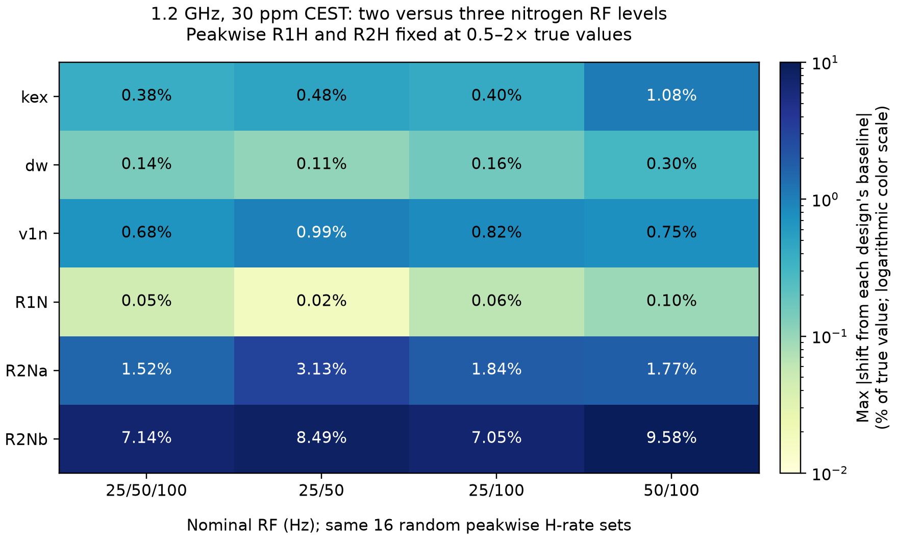

# 2개 v1N RF 세기 사용 시 fitting 검사

검사일: 2026-10-02. **서로 다른 B₀ 장비 두 대가 아니라, 한 1.2 GHz 장비에서 ¹⁵N RF 세기 두 개를 사용하는 경우**다.

## 결과 요약

이번 합성 조건에서는 **25/100 Hz가 두 세기 중 가장 균형 잡힌 정밀도**를 보였다.
같은 scan 수에서 측정 조건 수를 1/3 줄이면서, kex 표준오차 증가는 약 7%, v1n은 약 18%였다.
총 시간을 같게 유지해 남은 두 세기에 scan을 더 배분하는 이상적인 경우에는
kex 표준오차가 3세기 대비 약 13% 작고, v1n은 약 4% 작을 것으로 계산된다.
이는 H rates를 올바르게 고정했을 때의 국소 정밀도 비교다.
H rates를 잘못 고정했을 때의 편향은 아래에서 별도로 비교한다.
50/100 Hz는 kex 표준오차가 같은 scan 수에서 약 3.24배로 커졌다.
두 세기로 줄이는 것만으로 H-rate 불확도의 영향이 없어지지는 않는다.

## 비교 조건

기존 25/50/100 Hz의 3세기 데이터를 25/50, 25/100, 50/100 Hz로 줄였다.
남긴 파일의 offset, intensity, 오차와 잡음 realization은 바꾸지 않았다.
Decoupling sideband를 포함한 30 ppm 전체 profile을 사용하며, sideband 주변 점을 제외하지 않았다.
3개 합성 peak에 대해 `kab`, `kba`, 공통 `v1n_scale` 및 peak별 질소 파라미터를 fitting했다.
실제 RF의 생성값은 명목 RF × 1.08이며, 두 RF를 독립적인 Hz 파라미터로 푼 검사는 아니다.

- ¹H 1200 MHz / ¹⁵N 121.5949416 MHz, 105–135 ppm, RF당 147 offset.
- T=0.4 s, intensity σ=0.001, 90°x–240°y–90°x 반복 RR, p90=70 μs.
- Peak별 독립 R1H/R2H를 각 fitting에서 고정. 한 peak의 A/B 상태와 RF 파일에서는 같은 값을 사용.
- 참값 H 대조군 및 기존과 동일한 무작위 H 값 64세트(4조건 × 16회)를 RF 조합마다 검사.
- 관측 intensity 수: 1323 → 882. 자유 파라미터는 18개로 동일하며 dof는 1305 → 864.
- 실제 offset×RF 측정 조건 수는 441 → 294. 같은 scan 수라면 측정 시간은 약 2/3이다.

## 올바른 H 값을 고정한 기준 fitting

아래는 동일한 기존 잡음 데이터의 부분집합을 사용한 결과다.
± 값은 입력 오차를 절대 σ로 사용하는 국소 표준오차이며 reduced χ²로 재조정하지 않았다.

| RF (Hz) | kex (s⁻¹) | pB | v1n_scale | Reduced χ² | Rank |
|---|---:|---:|---:|---:|---:|
| 25/50/100 | 299.5529 ± 0.6165 | 0.049939 | 1.080863 ± 0.001766 | 0.9472 | 18/18 |
| 25/50 | 299.2838 ± 0.8413 | 0.050223 | 1.077315 ± 0.002916 | 0.9549 | 18/18 |
| 25/100 | 299.6887 ± 0.6604 | 0.049793 | 1.082723 ± 0.002095 | 0.9354 | 18/18 |
| 50/100 | 298.4288 ± 2.0059 | 0.050059 | 1.080962 ± 0.002167 | 0.9531 | 18/18 |

세 조합 모두 무잡음에서 전체 18개 파라미터의 생성값을 복원했다.
생성값: kex=300 s⁻¹, pB=0.05, v1n_scale=1.08.

## 정밀도: 3세기 대비 표준오차 배율

잡음의 우연한 차이를 피하기 위해 생성값에서 평가한 무잡음 fit의 covariance를 비교했다.
오차 모델은 동일한 σ=0.001이다. 1배보다 크면 3세기보다 표준오차가 크다.
잔기별 파라미터는 각 잔기를 대응시킨 비율 중 최댓값을 표시한다.

| 파라미터 | 25/50 | 25/100 | 50/100 |
|---|---:|---:|---:|
| kex | 1.366× | 1.071× | 3.244× |
| dw | 1.335× | 1.172× | 1.830× |
| v1n | 1.631× | 1.177× | 1.232× |
| R1N | 1.171× | 1.229× | 1.398× |
| R2Na | 1.808× | 1.162× | 1.206× |
| R2Nb | 1.905× | 1.100× | 1.309× |

### 총 측정 시간을 같게 배분하는 경우

두 RF에 각각 1.5배 scan을 배분하고, σ가 1/√scan에 비례한다고 가정하면
위 표준오차에 √(2/3)=0.8165를 곱할 수 있다. 일정한 overhead와 noise model을
가정한 **분석적 예상**이며, 새 scan이나 잡음 데이터를 생성한 결과는 아니다.

| 파라미터 | 25/50 | 25/100 | 50/100 |
|---|---:|---:|---:|
| kex | 1.115× | 0.874× | 2.649× |
| dw | 1.090× | 0.957× | 1.494× |
| v1n | 1.331× | 0.961× | 1.006× |
| R1N | 0.956× | 1.003× | 1.142× |
| R2Na | 1.476× | 0.949× | 0.985× |
| R2Nb | 1.555× | 0.898× | 1.069× |

H 값을 잘못 고정해서 생긴 모델 편향은 모든 점의 σ를 동일 비율로 낮춘다고
제거되지 않는다. 동일한 잔차 가중치 배율은 최적점을 바꾸지 않는다.

## 무작위 H 고정값에 대한 민감도

각 조합의 올바른 H 기준 fit과의 차이를 |파라미터 생성값|으로 나눈 최대 변화율이다.
±20%는 U(0.8,1.2), 0.5–2배는 log-U(0.5,2)에서 peak별·rate별로 독립 추출했다.
넓은 범위의 세 조건은 동일한 난수쌍을 사용하며 seed는 20261004다.
모든 조합에 동일한 peak별 H 난수 16세트를 적용했다. 표의 최댓값은 관찰된 표본의
최댓값이며, 모든 가능한 H 입력에 대한 보장 범위나 confidence interval이 아니다.

### R1H·R2H 모두 참값의 0.5–2배로 변경

| 파라미터 | 25/50/100 | 25/50 | 25/100 | 50/100 |
|---|---:|---:|---:|---:|
| kex | 0.3824% | 0.4832% | 0.4039% | 1.0826% |
| dw | 0.1427% | 0.1064% | 0.1597% | 0.2991% |
| v1n | 0.6800% | 0.9852% | 0.8186% | 0.7504% |
| R1N | 0.0458% | 0.0175% | 0.0630% | 0.0952% |
| R2Na | 1.5197% | 3.1271% | 1.8355% | 1.7707% |
| R2Nb | 7.1396% | 8.4935% | 7.0519% | 9.5813% |



25/100 Hz의 v1n 최대 변화는 0.819%로, 3세기의 0.680%와 비교된다.
25/100 Hz 기준 국소 표준오차의 4.22배에 해당한다.
따라서 작은 상대 변화율만 보고 H-rate 오차를 무시하면 RF calibration의 불확도를 과소평가할 수 있다.

### 둘 다 ±20%

| 파라미터 | 25/50/100 | 25/50 | 25/100 | 50/100 |
|---|---:|---:|---:|---:|
| kex | 0.1109% | 0.1449% | 0.1091% | 0.2670% |
| dw | 0.0418% | 0.0320% | 0.0548% | 0.0580% |
| v1n | 0.1368% | 0.3896% | 0.2692% | 0.1407% |
| R1N | 0.0119% | 0.0072% | 0.0175% | 0.0234% |
| R2Na | 0.3618% | 0.9954% | 0.7002% | 0.5550% |
| R2Nb | 1.9739% | 2.8274% | 1.9830% | 2.4186% |

### R1H만 0.5–2배

| 파라미터 | 25/50/100 | 25/50 | 25/100 | 50/100 |
|---|---:|---:|---:|---:|
| kex | 0.0211% | 0.0307% | 0.0212% | 0.0425% |
| dw | 0.0072% | 0.0047% | 0.0071% | 0.0123% |
| v1n | 0.0268% | 0.0524% | 0.0605% | 0.0349% |
| R1N | 0.0025% | 0.0012% | 0.0033% | 0.0048% |
| R2Na | 0.0679% | 0.1725% | 0.1404% | 0.0946% |
| R2Nb | 0.3666% | 0.4333% | 0.3846% | 0.4990% |

### R2H만 0.5–2배

| 파라미터 | 25/50/100 | 25/50 | 25/100 | 50/100 |
|---|---:|---:|---:|---:|
| kex | 0.3887% | 0.4895% | 0.3984% | 1.0896% |
| dw | 0.1424% | 0.1034% | 0.1610% | 0.3021% |
| v1n | 0.7157% | 1.0055% | 0.8173% | 0.7990% |
| R1N | 0.0465% | 0.0185% | 0.0640% | 0.0967% |
| R2Na | 1.6084% | 3.1730% | 1.7955% | 1.8888% |
| R2Nb | 7.2248% | 8.5776% | 7.1627% | 9.6097% |

## 잘못된 H 값을 사용했을 때의 fit quality

두 H rates를 0.5–2배로 변경한 16회 결과다. 데이터 수가 다르므로 raw χ²의
크기를 직접 비교하지 않는다. 아래에는 reduced χ² 범위와 경계 도달 횟수를 표시한다.

| RF (Hz) | Reduced χ² min | max | 경계 도달 fit 수 |
|---|---:|---:|---:|
| 25/50/100 | 1.0197 | 1.5096 | 0 |
| 25/50 | 0.9820 | 1.1675 | 0 |
| 25/100 | 1.0176 | 1.5925 | 0 |
| 50/100 | 1.0528 | 1.6590 | 0 |

## 검증 및 범위

새 fitting 211회를 완료했다. 기존 3세기 난수 결과 64회는 보존된 결과를 재사용했다.
3세기 대조군을 새 코드로 다시 실행해 기존 결과와 일치하는지 확인했다.
각 2세기 조합의 무잡음 복원, rank, 중앙 차분 covariance를 검사했다.
조합별 파라미터 변화와 χ²가 큰 사례는 다른 초기값과 무잡음 데이터로 재검사했다.
정확한 재검사 목록은 `restart_check_*`, `exact_check_*` JSON에 있다.

이 결론은 한 B₀, 세 개의 합성 peak, 동일한 잡음 realization에 대한 것이다.
다른 교환 속도·population·H shift·offset 간격·T·SNR에서는 RF 조합의 순위가 바뀔 수 있다.
H rates를 자유롭게 fitting하거나 두 RF를 각각 독립 calibration 파라미터로 푼 결과는 아니다.
기존 production CLI는 변경하지 않았다.

실험 설계 관점에서는 25/100 Hz를 우선 비교할 수 있다. 다만 이번 계산에서의 시간 효율과
실제 시료에서의 H-rate 민감도는 별개이므로, peak별 R2H 가정에 대한 민감도 검사는 유지해야 한다.

```bash
cd /Users/donghanlee/work/projects/sbonest
.venv/bin/python check_two_rf.py --out results/two_RF_repeat_01 --workers 3
```

새 출력 폴더를 사용한다. 기존 결과를 덮어쓰지 않는다.

[검사 코드](check_two_rf.py) · [전체 결과 CSV](results/two_RF_check/results.csv) ·
[결과 JSON](results/two_RF_check/results.json) · [통계 JSON](results/two_RF_check/statistics.json) ·
[입력과 source hash](results/two_RF_check/metadata.json) · [그림 PDF](results/two_RF_check/sensitivity_comparison.pdf) ·
[보고서/그림 생성 코드](results/two_RF_check/summarize.py) · [기존 3세기 검사](RANDOM_PROTON_RELAXATION_CHECK.md)
