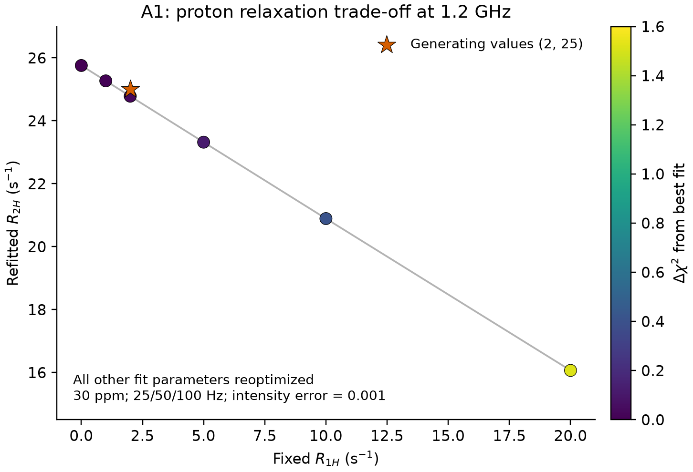

# Peak별 R1H·R2H fitting 검사

검사일: 2026-10-02. 모든 결과는 **합성 데이터**에 대한 계산이다.

후속 검사: [R1H·R2H를 peak별 무작위 값으로 고정했을 때 나머지 파라미터의 변화](RANDOM_PROTON_RELAXATION_CHECK.md).

## 결과

`R1H`, `R2H`를 **각 peak의 독립적인 파라미터**로 fitting할 수 있다.
무잡음에서는 원래 값을 복원했지만, 현재 1.2 GHz·30 ppm·약 25 Hz 간격의
데이터에서는 두 값을 동시에 정밀하게 추정하기 어렵다. 같은 peak 안에서
두 값이 강하게 반상관하며 서로 보상한다. 특히 `R1H`의 국소 표준오차가
생성값보다 크고, 잡음 데이터의 A1에서는 0 경계에 도달했다.

이번 조건에서 `R1H`를 고정하고 peak별 `R2H`를 fitting하면 조건부 오차가
작아진다. 다만 `R1H`를 정확히 안다는 가정에 의존하므로, 실제 실험에서는
고정값을 바꾸는 민감도 검사도 필요하다.

## 파라미터의 공유 범위

- `kab`, `kba`: 이 합성 예제에서 같은 교환 과정을 가진 peak들이 공유한다.
- `v1n_scale`: 동일 calibration을 가정한 모든 RF 파일과 peak가 공유한다.
- `peak_ppm`, `dw_ppm`, `R1`, `R2a`, `R2b`, **`R1H`, `R2H`**: peak별 독립값이다.
- 동일 peak의 25/50/100 Hz 데이터는 같은 proton relaxation 값을 사용한다.
- 이 검사에서는 각 peak의 상태 A/B가 같은 proton relaxation 값을 가진다고
  가정했다. 상태별 독립 relaxation까지 구분한 검사는 아니다.

3개 peak에서 기본 질소/RF 모델은 18개, peak별 `R2H`를 추가하면 21개,
peak별 `R1H`와 `R2H`를 모두 추가하면 **24개**의 자유 파라미터다.
서로 다른 peak의 proton relaxation을 공통값으로 묶지 않았다.

## 공통 실험 조건

| 항목 | 설정 |
|---|---|
| ¹H / ¹⁵N 주파수 | 1200 / 121.5949416 MHz |
| Offset | 105–135 ppm, RF당 147점, 간격 24.985 Hz |
| Saturation time | 0.4 s |
| 명목 ¹⁵N RF | 25, 50, 100 Hz |
| 실제 RF scale | 1.08 |
| Decoupling | 반복 RR; R = 90°x–240°y–90°x |
| 90° pulse / ¹H carrier | 70 μs / 8.5 ppm |
| J / ¹H B1 scale | 92 Hz / 1 |
| Intensity noise σ | 0.001, 독립 Gaussian 합성 잡음 |
| 교환 생성값 | kex = 300 s⁻¹, pB = 0.05 |

3-peak 데이터는 peak마다 다른 N/H chemical shift와 relaxation을 사용했다.
시료를 대표한다는 가정 없이 식별성을 확인하기 위해 정한 조건이다.
정확한 생성값과 seed는 [3-peak summary](../../results/peakwise_H_fit/summary.json)에 있다.

## 1. 3개 peak의 독립 proton relaxation fitting

무잡음에서 24개 파라미터를 모두 복원했고, χ²는 약 `2.08 × 10⁻¹⁶`이었다.
다음 표는 **잡음 데이터에서 두 proton rate를 모두 자유롭게 fitting한 결과**다.
단위는 s⁻¹이며 `±`는 입력 σ를 기준으로 한 국소 선형 표준오차다.

| Peak | R1H 생성값 | R1H fitting | R2H 생성값 | R2H fitting | R1H–R2H correlation |
|---|---:|---:|---:|---:|---:|
| A1 | 2.0 | 0.000 ± 16.355 | 25.0 | 26.383 ± 8.053 | −0.992 |
| G2 | 1.2 | 0.541 ± 5.611 | 18.0 | 19.698 ± 2.637 | −0.964 |
| S3 | 3.0 | 0.245 ± 7.645 | 35.0 | 34.410 ± 3.733 | −0.946 |

A1의 `R1H=0`은 optimizer가 도달한 하한이며 실제 relaxation이 없다는 증거가
아니다. 이 표의 대칭 표준오차는 경계를 고려한 confidence interval이 아니다.
Jacobian rank는 24/24였지만, 이것만으로 모든 파라미터를 정밀하게 추정할
수 있다는 뜻은 아니다.

각 peak의 `R1H`를 생성값으로 고정한 **조건부** `R2H` fitting 결과:

| Peak | 고정 R1H | Fitting한 R2H | 두 rate를 함께 풀 때의 R2H 표준오차 |
|---|---:|---:|---:|
| A1 | 2.0 | 25.405 ± 1.019 | 8.053 |
| G2 | 1.2 | 19.399 ± 0.698 | 2.637 |
| S3 | 3.0 | 33.138 ± 1.213 | 3.733 |

이 조건부 비교에서 R2H 오차는 두 rate를 함께 풀 때 약 3.1–7.9배 커진다.
오차가 작은 조건부 결과도, 고정한 R1H 값이 틀리면 편향될 수 있다.

전역 exchange/RF 파라미터의 비교:

| Proton rate 처리 | 자유 파라미터 수 | χ² | kex (s⁻¹) | pB | v1n_scale |
|---|---:|---:|---:|---:|---:|
| 각 peak의 H rates를 생성값으로 고정 | 18 | 1236.0425 | 299.5531 | 0.0499399 | 1.0808512 |
| peak별 R2H fitting; R1H는 생성값 고정 | 21 | 1229.3847 | 299.5092 | 0.0499589 | 1.0806321 |
| peak별 R1H·R2H 모두 fitting | 24 | 1229.1851 | 299.4980 | 0.0499607 | 1.0806102 |

R2H만 fitting한 모델에 R1H 3개를 추가해도 χ² 개선은 약 0.200이었다.
이 예제에서는 proton rate의 개별 추정이 불안정해도 교환/RF 결과는 크게
변하지 않았다. 실제 데이터에서도 같은 결과가 보장되는 것은 아니다.

## 2. 기존 A1 단일 peak 데이터의 대조 검사

기존 논문 폴더의 441점 데이터를 그대로 사용했다. 모든 행에서
질소 파라미터와 `v1n_scale`을 함께 fitting했다.

| 추가로 자유롭게 둔 H rate | R1H (s⁻¹) | R2H (s⁻¹) | χ² |
|---|---:|---:|---:|
| 없음 | 2, 고정 | 25, 고정 | 419.1061 |
| R1H만 | 1.517 ± 2.103 | 25, 고정 | 419.0549 |
| R2H만 | 2, 고정 | 24.783 ± 1.035 | 419.0635 |
| 둘 다 | 0.000 ± 16.706 | 25.759 ± 8.228 | 419.0370 |

두 rate를 함께 풀 때의 시작값을 `(8,40)`, `(0.2,5)`, `(60,100)`으로 바꿔도
같은 경계 해와 χ²를 얻었다. 무잡음에서는 `(2,25)`를 복원했으므로 단순한
초기값 실패로 설명되는 현상은 아니다.

RF scale을 정확한 생성값 1.08로 고정해도 R1H/R2H의 국소 표준오차는
각각 약 16.464/8.149 s⁻¹이었다. 이 조건의 주된 모호성은 두 proton rate
사이의 보상이며, nitrogen RF를 정확히 안다고 모두 해소되지 않았다.

H rates를 고정한 결과와 둘 다 풀어 fitting한 결과를 비교하면,
`kex`의 국소 표준오차는 1.004 → 1.048 s⁻¹, `v1n_scale`은
0.003226 → 0.003389로 증가했다. 이 데이터에서는 각각 약 4.3%, 5.0% 증가다.

## 3. R1H를 고정하고 나머지를 재fitting한 χ² profile

아래 각 행은 R1H를 해당 값에 고정하고 **R2H와 모든 질소/RF 파라미터를
다시 최적화한 결과**다. 최적점에 대한 Δχ²를 표시한다.

| 고정 R1H (s⁻¹) | 다시 fitting한 R2H (s⁻¹) | Δχ² |
|---|---:|---:|
| 0 | 25.759 | 0 |
| 2 | 24.783 | 0.027 |
| 5 | 23.321 | 0.117 |
| 10 | 20.893 | 0.407 |
| 20 | 16.067 | 1.513 |



그림은 R1H 0–20 s⁻¹ 범위를 보여준다. 전체 검사 grid는
[profiles.json](../../results/proton_relaxation_fit/profiles.json)에 보존했다.
이 결과를 정식 confidence interval로 변환하지 않았다.

생성값 주변의 국소 covariance에서는 `R2H + 0.488 × R1H`라는 조합의
표준오차가 약 1.046 s⁻¹로 계산된다. 이는 각 rate를 따로 결정하는 것보다
그 조합을 더 잘 결정한다는 의미다. 계수 0.488은 이 peak와 pulse 조건에
대한 수치 결과이며 보편적인 decoupling 계산식이 아니다.

## 해석 범위와 실험 적용

- Peak별 proton relaxation을 허용하는 구조가 적절하다. 단, 이번 검사는
  같은 peak 내 A/B 상태의 H relaxation은 같다는 추가 가정을 사용했다.
- 현재 조건에서는 peak별 R1H를 고정하거나 외부 정보로 제한하고,
  peak별 R2H부터 fitting하는 것이 더 안정적이었다.
- R1H·R2H를 모두 풀 때는 경계, 상관관계, profile을 함께 보고해야 한다.
  매우 작은 `R1H` 추정값을 곧바로 물리적인 장수명으로 해석하면 안 된다.
- 사용한 bounds는 R1H 0–200, R2H 0–500 s⁻¹이다. 비음수 조건 외에 두
  rate 사이의 추가 물리적 관계를 강제하지 않았다. 넓은 profile grid의
  모든 점을 물리적으로 타당한 실험 후보로 해석하면 안 된다.
- 실제 시료의 residue별 값, 자기장/온도 의존성, 상태별 차이, RF 및 H shift
  오차에 대한 검증은 남아 있다. 각 데이터 세트는 하나의 합성 잡음
  realization이며, 반복 잡음 실험으로 confidence-interval coverage를 검증한
  결과는 아니다.

## 재현 및 검증

현재 production `run.py`의 JSON 인터페이스는 그대로다. 이번 추가 fitting은
아래 **검사용 스크립트**가 기존 SBONEST forward model을 재사용해 수행한다.
단일 peak 파일의 `R1H`/`R2H`는 A1만을 뜻하고, 3-peak 출력은
`A1.R1H`, `G2.R1H`, `S3.R1H`처럼 peak 이름을 명시한다.

```bash
cd /Users/donghanlee/work/projects/sbonest
.venv/bin/python scripts/check_proton_relaxation.py --out results/proton_H_repeat_01
.venv/bin/python scripts/check_peakwise_proton_relaxation.py --out results/peakwise_H_repeat_01
```

출력 폴더가 이미 있으면 중단한다. 재실행할 때는 새 이름을 사용한다.

검증 완료 항목:

1. 별도의 complex density-matrix 계산과 forward model의 수치 일치.
2. 변경한 H rates에 대한 independent propagator 비교.
3. 단일 peak 10개 및 3-peak 24개 파라미터의 무잡음 복원.
4. 기존 H 고정 fitting의 χ² 재현.
5. 모든 optimizer의 성공 종료, 단일 peak의 복수 초기값 검사.
6. Dense covariance 사용 및 finite-difference step/그룹 Jacobian 교차 확인.
   3-peak 보고 오차는 중앙 차분 Jacobian으로 계산했다.

원자료와 결과:

- [단일 peak 스크립트](../../scripts/check_proton_relaxation.py),
  [3-peak 스크립트](../../scripts/check_peakwise_proton_relaxation.py)
- [단일 peak fitting 전체 결과](../../results/proton_relaxation_fit/fits.json),
  [입력 조건·source hash](../../results/proton_relaxation_fit/metadata.json)
- [3-peak 생성값과 fitting 전체 결과](../../results/peakwise_H_fit/summary.json)
- [그림 PDF](../../results/proton_relaxation_fit/R1H_R2H_tradeoff.pdf),
  [그림 재생성 코드](../../results/proton_relaxation_fit/plot_tradeoff.py)
